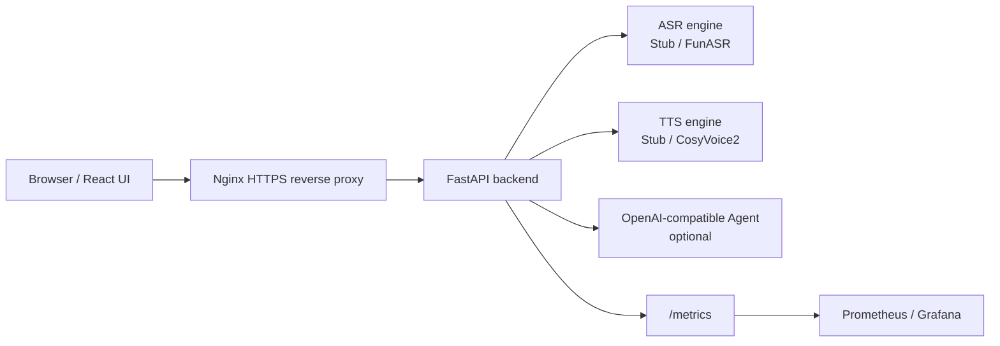

# 语音大模型服务（ASR / TTS / Speech-to-Speech Chat）

一个可自托管的语音大模型 Web 服务，提供 **语音识别 ASR**、**语音合成 TTS**、以及可选的 **语音到语音对话 Chat**。项目采用 FastAPI + React + Docker Compose，默认使用 stub 引擎，方便无 GPU 环境先跑通；生产环境可切换到 FunASR / CosyVoice2 等真实模型。

> 开源提示：本仓库不包含模型权重、参考音频、证书、API Key、SSH 私钥或任何云主机信息。请按本文档准备自己的资源，并遵守所使用模型和数据的许可协议。

## 功能特性

- **ASR**：文件转写、WebSocket 实时转写、FunASR/SenseVoice、2-pass 流式修正、热词偏置能力标记。
- **TTS**：文件式合成、WebSocket 流式合成、CosyVoice2 零样本音色、中文默认数字兜底、领域 TN（Text Normalization）配置。
- **Chat**：支持级联模式（流式 ASR → OpenAI-compatible Agent → 流式 TTS）和可选的原生端到端语音 Provider，支持动态模型/音色发现与 barge-in。
- **前端**：React + Vite，ASR/TTS/Chat 三个业务页面，模型发现、音色选择、QoS 信息展示。
- **工程化**：Docker Compose 部署、Nginx HTTPS 反代、Prometheus/Grafana 可观测性、并发限流、降级熔断、优雅退出。

## 架构概览



## 快速开始：本地无 GPU 跑通

### 1. 启动后端（stub 引擎）

```bash
cd backend
python3 -m venv .venv
source .venv/bin/activate
pip install -e ".[dev]"
cp .env.example .env
# .env 默认 ASR_ENGINE=stub、TTS_ENGINE=stub，可直接启动
uvicorn app.main:app --reload --host 127.0.0.1 --port 8000
```

验证：

```bash
curl http://127.0.0.1:8000/healthz
curl http://127.0.0.1:8000/api/v1/models
```

### 2. 启动前端

```bash
cd frontend
npm install
npm run dev
```

浏览器打开 Vite 输出的本地地址，即可使用 ASR/TTS/Chat 页面。Chat 默认关闭；未配置远端 Agent 时会提示不可用，但不影响 ASR/TTS。

### 3. 运行测试与构建

```bash
cd backend
ASR_ENGINE=stub TTS_ENGINE=stub CHAT_ENABLED=false pytest

cd ../frontend
npm run build
```

## 使用真实模型

真实模型需要你自行下载权重并准备运行环境：

- ASR：FunASR / ModelScope 权重，例如 SenseVoice、Paraformer streaming、SeacoParaformer。
- TTS：CosyVoice2 权重，以及用于零样本音色的 16 kHz WAV 参考音频和对应文本。
- GPU：生产环境建议 CUDA；本地可按能力选择 CPU/MPS/CUDA。

参考步骤：

```bash
cd backend
bash scripts/setup_funasr.sh
bash scripts/setup_cosyvoice.sh
python scripts/download_models.py --asr --tts
cp scripts/env.local.example .env
# 按你的本地模型路径、CosyVoice 仓库路径、参考音频路径修改 .env
uvicorn app.main:app --host 127.0.0.1 --port 8000
```

更详细的真实模型准备见 [docs/getting-started/local-models.md](docs/getting-started/local-models.md)。

## Docker Compose 部署（生产/演示）

> 安全提醒：backend 默认没有鉴权，不要把 8000 端口直接暴露到公网。请通过 Nginx/网关反代，并对公网入口启用 HTTPS、访问控制和日志审计。

1. 准备模型、音色与证书：

```bash
mkdir -p deploy/models deploy/voices deploy/certs
# 将你的模型权重放入 deploy/models/
# 将你的参考音频放入 deploy/voices/，例如 default.wav / male.wav
# 生成自签证书（生产建议使用正式域名证书）
openssl req -x509 -newkey rsa:2048 -nodes -days 365 \
  -keyout deploy/certs/server.key \
  -out deploy/certs/server.crt \
  -subj "/CN=localhost" \
  -addext "subjectAltName=DNS:localhost,IP:127.0.0.1"
```

2. 配置环境变量：

```bash
cp deploy/.env.deploy.example deploy/.env.deploy
# 修改 deploy/.env.deploy：模型路径、音色 JSON、CHAT_ENABLED、AGENT_ENDPOINT、AGENT_API_KEY 等
```

3. 启动服务：

```bash
docker compose -f deploy/docker-compose.yml up -d --build
docker compose -f deploy/docker-compose.yml ps
```

4. 可选：启动监控栈：

```bash
docker compose -f deploy/docker-compose.yml -f deploy/docker-compose.observability.yml up -d
```

更多部署细节见 [docs/deployment/public-deploy.md](docs/deployment/public-deploy.md)、[docs/deployment/https-self-signed.md](docs/deployment/https-self-signed.md) 和 [docs/observability/qos-monitoring.md](docs/observability/qos-monitoring.md)。

## 常用配置

| 配置项 | 说明 | 示例 |
| --- | --- | --- |
| `ASR_ENGINE` | ASR 引擎：`stub` / `funasr` | `funasr` |
| `TTS_ENGINE` | TTS 引擎：`stub` / `cosyvoice` | `cosyvoice` |
| `DEVICE` | 计算设备：`cpu` / `mps` / `cuda` | `cuda` |
| `FUNASR_MODEL` | FunASR 主模型 ID 或本地路径 | `/models/iic__SenseVoiceSmall` |
| `COSYVOICE_REPO_DIR` | CosyVoice 仓库根目录 | `/opt/CosyVoice` |
| `COSYVOICE_MODEL` | CosyVoice2 模型 ID 或本地路径 | `/models/iic__CosyVoice2-0.5B` |
| `COSYVOICE_VOICES` | 零样本音色 JSON；不要提交真实私有音频 | 见 `backend/.env.example` |
| `CHAT_ENABLED` | 是否启用语音聊天 | `false` |
| `AGENT_ENDPOINT` | OpenAI-compatible API base URL | `https://api.openai.com/v1` 或你的兼容服务 |
| `AGENT_API_KEY` | 远端 Agent API Key | 仅写入本地 `.env` / `deploy/.env.deploy` |
| `QWEN_OMNI_ENABLED` | 是否启用原生端到端语音模式 | `false` |
| `QWEN_OMNI_ENDPOINT` | Qwen-Omni-Realtime WebSocket 地址 | `wss://<WorkspaceId>.<region>.maas.aliyuncs.com/api-ws/v1/realtime` |
| `QWEN_OMNI_SILENCE_MS` | 原生语音服务端 VAD 静音端点 | `2000` |

完整说明见 [docs/configuration.md](docs/configuration.md)。

## 文档目录

- [docs/README.md](docs/README.md)：文档索引
- [docs/asr/funasr.md](docs/asr/funasr.md)：ASR / FunASR 方案
- [docs/tts/cosyvoice2.md](docs/tts/cosyvoice2.md)：TTS / CosyVoice2 方案
- [docs/chat/speech-to-speech.md](docs/chat/speech-to-speech.md)：语音到语音对话方案
- [docs/chat/native-speech-upgrade.md](docs/chat/native-speech-upgrade.md)：原生端到端语音升级与 A/B 验收
- [docs/deployment/public-deploy.md](docs/deployment/public-deploy.md)：公网部署 Runbook

## 安全与隐私

- 不要提交 `.env`、`deploy/.env.deploy`、`deploy/sync.env`、模型权重、参考音频、证书私钥或 SSH 私钥。
- 文档里的 `your-domain.example.com`、`<PRIVATE_BACKEND_HOST>`、`~/.ssh/your_key.pem` 等均为占位符，请替换为自己的信息。
- 如需公开演示，请为公网入口加 HTTPS、鉴权、限流和日志；浏览器麦克风通常需要安全上下文（HTTPS 或 localhost）。
- 发现安全问题请参考 [SECURITY.md](SECURITY.md)。

## 贡献

欢迎提交 Issue 和 Pull Request。请先阅读 [CONTRIBUTING.md](CONTRIBUTING.md)，并确保：

- 新功能包含必要测试或手工验证说明；
- 不引入真实密钥、IP、私有路径或大模型权重；
- 前端构建与后端测试通过。

## 许可证

本项目代码采用 MIT License。模型权重、第三方模型仓库、数据集和参考音频遵循各自的许可证与使用条款，不随本仓库授权。
